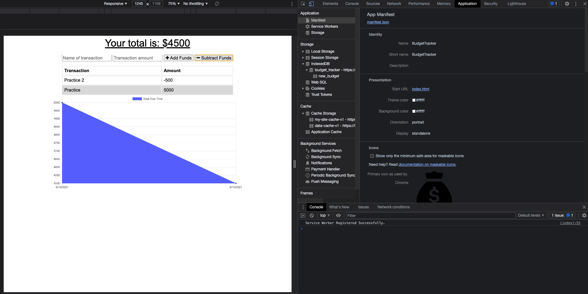

# budget-tracker

## Description

AS AN avid traveler

I WANT to be able to track my withdrawals and deposits with or without a data/internet connection

SO THAT my account balance is accurate when I am traveling 

[Link to deployed application on Heroku](https://budget-tracker-app-2021.herokuapp.com/)

## Table of content
* [Description](#description)
* [Project Requirements](#projectrequirements)
* [Installation](#installation)
* [Usage](#usage)
* [Credits](#credits)
* [License](#license)
* [Badges](#Badges)
* [Contributing](#contributing)

## Preview

## Project Requirements

* WHEN the user inputs an expense or deposit
    
    `THEN they will receive a notification that they have added an expense or deposit`

* WHEN the user reestablishes an internet connection

    `THEN the deposits or expenses added while they were offline are added to their transaction history and their totals are updated`

## Installation

Clone the application onto your system and run `npm install` to install the packages.

Also, At the top right of the browser tab is an option to download the application unto your system as a PWA.

## Usage 

From the command line, at the root of the application folder, run `npm start` to start the server and then navigate to `http://localhost:3001` in your browser to work with the application.

## Credit
This app was made with love and hardwork by Praise Opara

## License

[MIT](https://opensource.org/licenses/MIT)

## Badges

## Contributing

